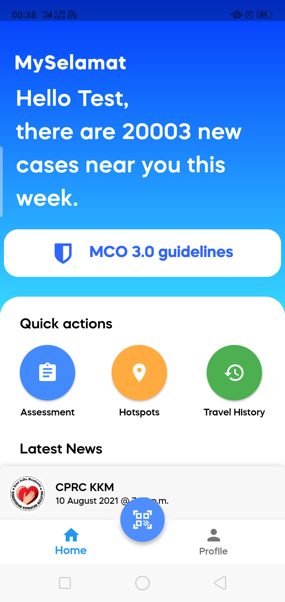
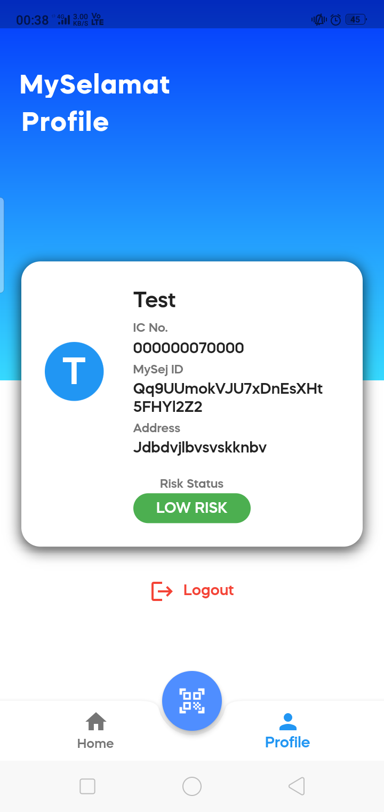
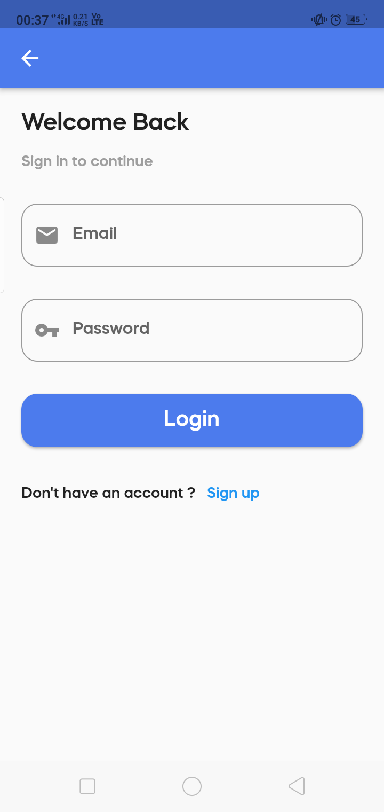
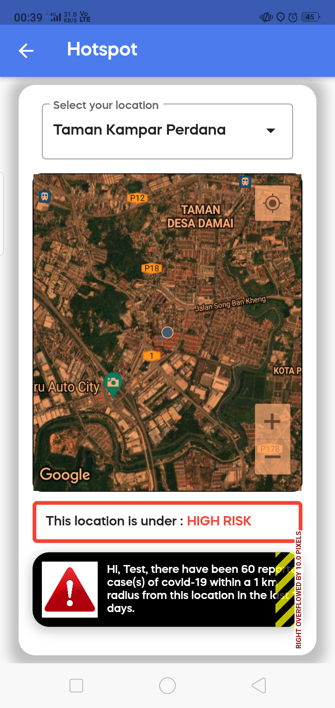
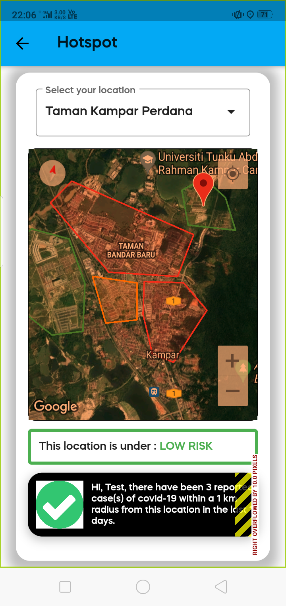
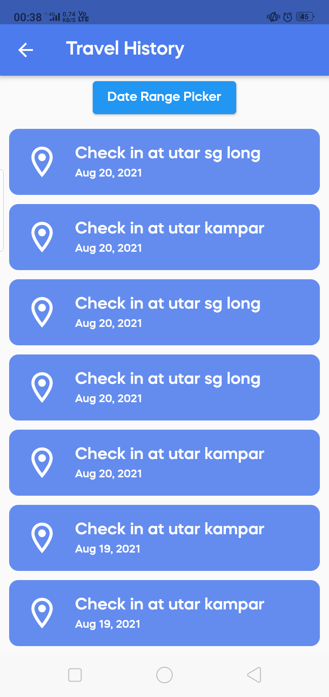
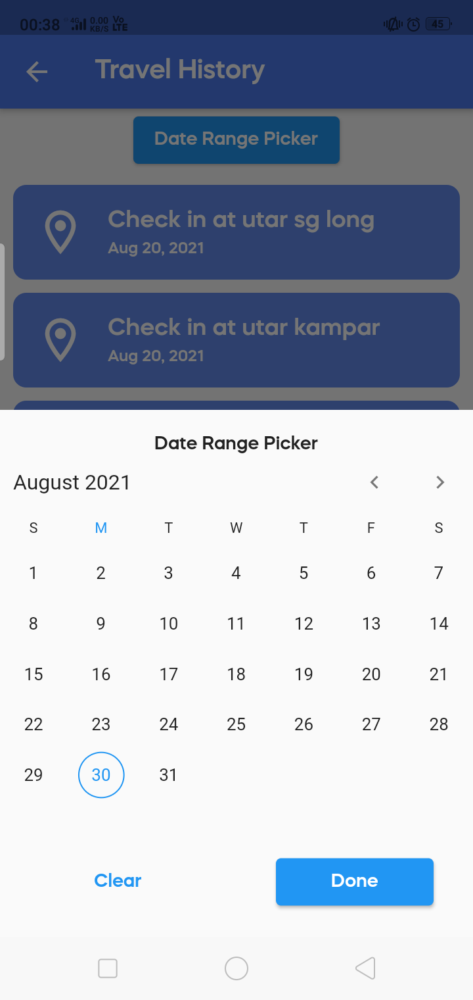
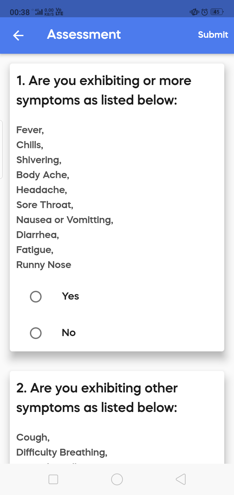

# MySelamat

A Flutter application for UCCC2513 Mini Project (UTAR).

Developed to manage the COVID-19 outbreak
by implementing functional modules such as the COVID-19 Status module, COVID-19 Travel History Module, and COVID-19 Hotspot module.

## Screenshots

        
        
        

        
        
        

        
        
        

## Acknowledgements
 - [MySejahtera-Redesign](https://mysejahtera.malaysia.gov.my/intro/)
 - [Design Template](https://github.com/vrevolverrr/mysejahtera)

 
